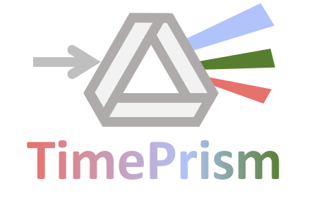
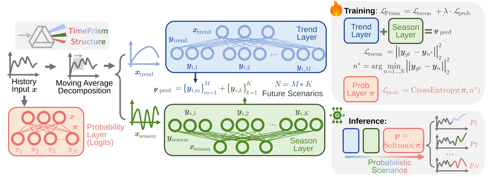

# From Samples to Scenarios: A New Paradigm for Probabilistic Forecasting

<div align="center">

 &nbsp;
<a href="https://arxiv.org/abs/2509.19975"></a>
<a href="[#](https://arxiv.org/abs/2509.19975)"></a>


> **TL;DR:** Introduced a **Sampling-Free paradigm**, with which a **linear model** achieves **SOTA** against complex forecasting models.

</div>

---

## 📖 Abstract

Most state-of-the-art probabilistic time series forecasting models rely on sampling to represent future uncertainty. However, this paradigm suffers from inherent limitations. In this work, we introduce **Probabilistic Scenarios**, an alternative paradigm designed to address the limitations of sampling. It operates by directly producing a finite set of \{Scenario, Probability\} pairs, thus avoiding Monte Carlo-like approximation. To validate this paradigm, we propose **TimePrism**.

</br>

## 🧩 Architecture: Minimalist yet Powerful

We intentionally designed **TimePrism** to be incredibly simple using merely **three parallel linear layers**. By stripping away architectural complexity (no attention, no diffusion, no recurrent layers), we prove that the performance gains stem fundamentally from the **Probabilistic Scenarios** paradigm. 

<div align="center">
  
</div>
<br>

> **💡 Insights: Reframing of the learning objective.**  Instead of modeling an entire continuous probability space, the model learns to represent a set of plausible scenarios and corresponding probabilities.

## 📁 Repository Structure

```shell
└── tsExperiments # Main Experiments 
└── images
```


## 🔥 Datasets Experiments

### 🔨 Setup

To reproduce the experiments, you can set up an environment as follows. This setup assumes you have Python3 installed (we used Python 3.10.15).

```shell
cd tsExperiments
bash setup-env.sh
```

The environment variable ENV_DIR should then be set. After running the setup script, the environment variable ENV_DIR will be set. Activate the environment with:

```shell
source $ENV_DIR/bin/activate
```

The gluonts datasets (`electricity`, `exchange`, `solar`, `traffic`, `wiki`) will be downloaded automatically under `~/.gluonts/datasets` when calling for the first time the `get_dataset` function from gluonts. 
```bash
python download_datasets.py
```
If you already have these glounts datasets, you can directly put them here:
```shell
tsExperiments
   └── gluonts_cache/datasets
```
### 🔄 Training

To train TimePrism with 625 scenarios on the datasets (`electricity`, `exchange`, `solar`, `traffic`, `wiki`) using seed 3141 (with default parameters). You can set `num_hyps=625`, `seed=3141`, `datasets=all` and run the following commands:

```shell
bash train.sh $seed $datasets timePrism $num_hyps Short # For the Short history version as in the main results
```

To train the different baselines, on all the datasets use the following commands:

```shell
bash train.sh $seed $datasets tempflow
bash train.sh $seed $datasets tactis2
bash train.sh $seed $datasets timeGrad
bash train.sh $seed $datasets ETS
bash train.sh $seed $datasets deepAR
bash train.sh $seed $datasets transformer_tempflow
bash train.sh $seed $datasets timeMCL 16 relaxed-wta 
```


If you have the resources, you can run the above trainings with several seeds (like 3141, 3142, 3143), to be able to compute standard deviations on the scores of each baseline.

When launching the above trainings, the logs will be saved in `tsExperiments/logs` following the [Hydra](https://github.com/facebookresearch/hydra) template, that is organized as follows:

```shell
└── tsExperiments 
  └── logs
    └── <experiment_name> # By default: <dataset_name>_<num_epochs>
      └── runs
        └── <run_folder_name> # By Default: <start_run_time>_<dataset_name>_<model>_<num_hypotheses>_<model_specificities>, where start_run_time is in the form %Y-%m-%d_%H-%M-%S
          ├── Prediction_plot.png # Visualisations of the predictions on the test set (if enabled).
          ├── {context_points,forecast_length,freq_type,hypothesis_forecasts,is_mcl,target_df}.pkl # Raw data to reproduce the plot if needed.
          └── .hydra # Folder to save the config yaml files associated with the run
          └── checkpoints # Folder where the checkpoints are saved. By default, it contains epoch_{best_epoch_number}.ckpt and last.ckpt, where the best epoch number is based on the validation loss. 
          └── tensorboard # Folder that contains tensorboard event files. 
```

### 🔄 Inference and evaluation

#### 📥 Trained models checkpoints path extraction 

If you performed the training above, the checkpoints should be stored in `tsExperiments/logs`. In case you just want to launch evaluation with our models, the later can be downloaded with `python tsExperiments/download_ckpts.py`.

The general command to evaluate a model with a given checkpoint path, the command takes this form (except for tactis2):

```shell
python train.py ckpt_path=${ckpt_path} experiment=${dataset}.yaml model=${model}.yaml run_name=seed_${training_seed}_${dataset}_${model}_${num_hyp} model.params.num_hypotheses=${num_hyp} logger.mlflow.experiment_name=eval_${dataset} task_name=eval_${dataset} seed=${inference_seed} train=False test=True
```
where 
* `model` is the model to be evaluated, following the file names in `configs/model`.
* `training_seed` and `inference_seed` refer respectively to the seed that was used to train the model, and the seed that is used for evaluation.
* `dataset` is the dataset used for evaluation.
* `num_hyp` is the number of hypotheses, 16 for TimeMCL, 1 for other baselines. In this repo, we do not use `num_hyp` to represent number of sampling. For general cases, number of sampling is set to be 100.

For Tactis2, instead of `ckpt_path`, set `ckpt_path_phase1` and `ckpt_path_phase2` to the paths of the models for phase 1 and phase 2, respectively.

To avoid the burden of extracting each checkpoint path by hand, we provide `extract_ckpts.py`, a python script to automate checkpoint path extraction. It can be executed by running:

```shell
cd extract
python extract_ckpts.py --log_dir=tsExperiments/logs
```

where `--log_dir` specifices the logging directories. Then, a json file named `ckpts.json` and containing the checkpoint paths will be created in the folder `tsExperiments/`.

#### 📊 Inference, metrics computation and results extraction

In this case, the full evaluation can be performed by first installing `jq`, e.g., with `sudo apt-get update ; sudo apt-get install jq -y --fix-missing`. Then, having `seed`, `num_hyps` and `datasets` defined the evaluation scripts can be launched
```shell
bash train.sh $seed $datasets timePrism $num_hyps Short # For the Short history version 
```
and for the baselines:
```shell
bash eval.sh $seed $datasets $tempflow
bash eval.sh $seed $datasets $tactis2
bash eval.sh $seed $datasets $timeGrad
bash eval.sh $seed $datasets $deepAR
bash eval.sh $seed $datasets $transformer_tempflow
bash eval.sh $seed $datasets $timeMCL 16 relaxed-wta
```
To launch those scripts with the four random states provided in the checkpoints by settings `seed=all_seeds`. Update the `all_seeds` arrays in `eval.sh` accordingly if you ran the trainings by yourself.

The results can then be visualized with the integrated MLFLow logger. To do so, please move to the created MLFLow dir with `cd tsExperiments/logs/mlflow`. To do so, please define a port number, e.g., `PORT=5066`. Then, run 
```shell
GUNICORN_CMD_ARGS="--timeout 0" mlflow ui -p $PORT
``` 
The results can then be analyzed in `http://localhost:{PORT}/`.


The full results will be downloaded as raw CSV files (one for each dataset) in `tsExperiments/results/saved_csv` by running:
```shell
cd extract
bash extract_results.sh
```

To automatically parse these raw logs and generate **publication-ready tables** (formatted as `Mean ± Std` with proper significant figures), you can use our extraction script. The generated tables will be saved in the `experiment_results_csv/` directory. This will lead to the following tables in the paper: **Table 1 & 2** (Main Results) and **Table 6 & 7** (Appendix).

```shell
# Automatically aggregate results across all default seeds (3141, 3142, 3143)
python extract_tables.py

# Or specify particular seeds
python extract_tables.py --seeds 3141
```


### 📈 Visualisation

To reproduce visualisations from a series of windows with similar input but different output, you can run:
```shell
cd scripts_plot
python plot_similar_windows.py --model timePrism --dataset traffic --dim_to_plot 0 --num_hypotheses 625 --seed 3141
```

### ⚡ Computational cost evaluation

We provide a dedicated script, `flops.sh` in `tsExperiments/computation_flops` to compute floating point operations (with randomly initialized models). It can be executed as `cd tsExperiments/computation_flops ; bash flops.sh`.

After that, to get a csv table, you can further run:
```shell
python extract_flops.py
```


## 👍 Code Adaption Statement

This repository contains source code adapted from the following Github repositories, for which we greatly thank the authors:
[timeMCL](https://github.com/Victorletzelter/timeMCL) (under Apache-2.0 license)

[pytorch-ts](https://github.com/zalandoresearch/pytorch-ts) (under MIT License)

[tactis](https://github.com/servicenow/tactis) (under Apache License 2.0)

[fvcore](https://github.com/facebookresearch/fvcore) (under Apache License 2.0)

[gluonts](https://github.com/awslabs/gluonts) (under Apache License 2.0)

[statsmodels](https://github.com/statsmodels/statsmodels) (under BSD 3-Clause "New" or "Revised" License)

[pytorch-lightning](https://github.com/Lightning-AI/pytorch-lightning/blob/master/LICENSE) (under Apache 2.0 License)

[Hydra](https://github.com/facebookresearch/hydra) (under MIT License)

The experimental framework and code structure for this work were initially based on the public repository of timeMCL. We especially thank the authors for their contribution.

## 📝 Citation

If you find our work, the **Probabilistic Scenarios** paradigm, or this repository useful for your research, please consider citing our paper [From Samples to Scenarios: A New Paradigm for Probabilistic Forecasting](https://arxiv.org/abs/2509.19975):

```bibtex
@inproceedings{dai2026from,
  title={From Samples to Scenarios: A New Paradigm for Probabilistic Forecasting},
  author={Xilin Dai and Zhijian Xu and Wanxu Cai and Qiang Xu},
  booktitle={The Fourteenth International Conference on Learning Representations},
  year={2026},
}
